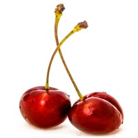

---
# Feel free to add content and custom Front Matter to this file.
# To modify the layout, see https://jekyllrb.com/docs/themes/#overriding-theme-defaults

layout: dufault
slug: home
---
<main >
          <section class="m-index">
          <!--视频-->
          <video  class="course-v" loop="loop" autoplay="" playsinline="" muted="" id="mejs_202297655532091_html5" preload="none" src="https://demo3.academyofmine.com/wp-content/uploads/2017/08/Cherries-1.mp4">
              <source type="video/mp4" src="https://demo3.academyofmine.com/wp-content/uploads/2017/08/Cherries-1.mp4">
          </video>
         <!--文本内容 -->
          

              

                  <h2 id="lcd"><a href="https://demo3.academyofmine.com/course/how-to-cook-cherries/start-course">Learn. Cherries. Delicios</a></h2>
                  

                      <h3>Learn how to Cook and Eat Delicious Cherries</h3>
                      

                  

                  
<a id="tfc" class="" href="https://demo3.academyofmine.com/course/how-to-cook-cherries/start-course">Take a Free Course</a>

              

          

          <!--视频结束-->

          <!--第二主体-->
          

              <!--第一部分-->
              

                  

                      

                              <h1 style="text-align: left;"><strong>Our Courses</strong></h1>
                              
Choose from a selection of our awesome courses below

                      

                  

                  <!--第二部分-->
                  

                      

                          <article  >
                              

                                  
                              

                              <h2 class="course-title">

                                  <a href="https://demo3.academyofmine.com/course/how-to-cook-cherries/">
                                      How To Cook Cherries       </a>
                                  

                                      
⭐⭐⭐⭐⭐(0reviews)

                                  

                              </h2>
                              

                              

                                  FREE    

                              

                              

                                  
                                  

                                      Tech Support        

                              

                          </article>
                      

                      

                          <article  >
                              

                                  
                              

                              <h2 class="course-title">

                                  <a href="https://demo3.academyofmine.com/course/how-to-cook-cherries/">
                                      How To Pick Cherries        </a>
                                  

                                      
⭐⭐⭐⭐⭐(0reviews)

                                  

                              </h2>
                              

                              

                                  <del>$99.00 $49.00</del>  

                              

                              

                                  
                                  

                                      Tech Support        

                              

                          </article>
                      

                      

                          <article  >
                              

                                  
                              

                              <h2 class="course-title">

                                  <a href="https://demo3.academyofmine.com/course/how-to-cook-cherries/">
                                      How To Farm Cherries         </a>
                                  

                                      
⭐⭐⭐⭐⭐(0reviews)

                                  

                              </h2>
                              

                              

                                  $149.00   

                              

                              

                                  
                                  

                                      Tech Support        

                              

                          </article>
                      

                  

              

          

          <!--第三主体-->
          

              

                  

                  
<h1 style="text-align: center;"><strong>Why Choose Us?</strong></h1>

              

                  

                      
<i class="glyphicon glyphicon-cloud-upload"></i>

                      

                          <h4 class="et_pb_module_header">Deep Industry Experience</h4>
                          

                              
We have more than 10 Years exprience in delivering quality learning on Cherry Farming

                          
<!-- .et_pb_blurb_description -->
                      

                  

                  

                      
<i class="glyphicon glyphicon-thumbs-up"></i>

                      

                          <h4 class="et_pb_module_header">Deep Industry ExperieBest-In-Class Instructors</h4>
                          

                              
Our engaging curriculum and dedicated staff helps you to learn techniques of farming easily.

                          
<!-- .et_pb_blurb_description -->
                      

                  

                  

                      
<i class="glyphicon glyphicon-bitcoin"></i>

                      

                          <h4 class="et_pb_module_header">DeeGrow your business.</h4>
                          

                              
Learn the skills you need to grow your business, or start your own cherry farm.

                          
<!-- .et_pb_blurb_description -->
                      

                  

              

              

              

          

          <!--第四主体-->
          

              

              

                  <h1>Click below to view all our Course Offerings</h1>
              

              
<a class="body4-2" href="https://demo3.academyofmine.com/our-courses/">Get Started</a>

              

          

          <!--第五部分-->
          

              

                  <h1 style="text-align: center;"><strong>What Other Farmers Are Saying about us?</strong></h1>
              

              

                  

                      

                          

                              
                          

                          

                              
Some really great information and very well presented

                              <strong >Yvette M. Northrop</strong>
                              
1533 Spring Haven Trail, NJ 07017

                          

                      

                      

                          

                              
                          

                          

                              
Course Curriculum is easy to follow and instructors are awesome.

                              <strong >Jessica R. Knight</strong>
                              
569 Private Lane Cordele, GA 31015

                          

                      

                      

                          

                              
                          

                          

                              
Some really great information and very well presented

                              <strong >Sherry M. Hughes</strong>
                              
2018 Wright Court, AL 35546

                          

                      

                  

              

          

          <!--第六部分-->
          

                  

                      

                          <h1>Look No Further. Get Started Today</h1>
                          <h4>Registed for all our courses with 50% discount</h4>
                      

                      
<a class="body4-2" href="https://demo3.academyofmine.com/our-courses/">Join Now</a>

                  

              

          <!--第七部分-->
          

              

                          

                          

                              <h2>Subscribe to get FREE Cherry Tips</h2>
We send new tips&nbsp;every month to enhance your Cherry Farming Skills

                          

                      

                          <form action="" method="post">
                              

                                  

                                      @
                                      <input type="text" class="form-control" placeholder="Email" aria-describedby="basic-addon1">
                                  

                                  

                                      <button type="button" class="btn btn-default">Subcribte</button>
                                  

                              

                          </form>
                      

              

          

          </section>
          <!--第七部分结束-->
      </main>
